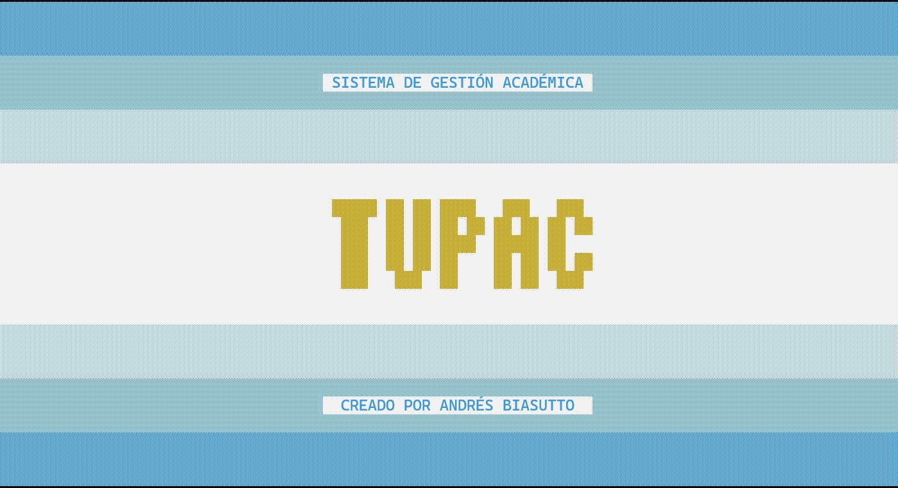
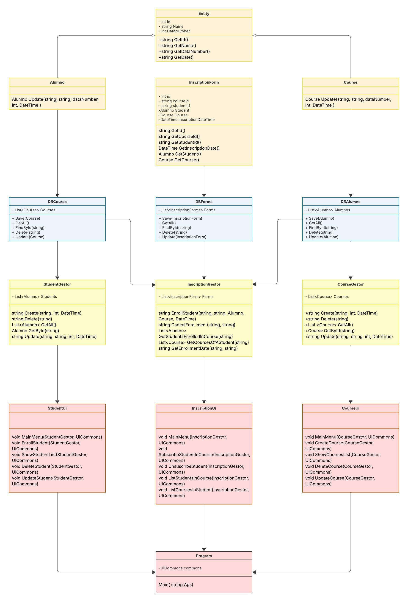

# Sistema de Gestión Académica - **TupacAlumnos**
 
Proyecto desarrollado como parte del **Trabajo Práctico de Programación 1**.  
Permite la gestión de estudiantes, cursos e inscripciones académicas mediante una arquitectura en capas clara y modular.

---

## Datos del Alumno

- **Nombre completo:** Biasutto Andrés Alberto  

**Docente Responsable:** Javier Pablo de Jorge  

---

## Estructura del Proyecto

```
TupacAlumnos/
├── UI/               # Interfaz de usuario (menú y entrada/salida por consola)
├── DB/               # Acceso a datos y persistencia
├── BR/
│   ├── Entidades/    # Clases que representan alumnos, cursos y formularios
│   └── Servicios/    # Lógica de negocio y gestores académicos
└── utils/            # Utilidades y validaciones
```

---

## Instrucciones de Ejecución

1. Abrir la carpeta del proyecto en **Visual Studio Code**
2. Compilar:
   ```bash
   dotnet build
   ```
3. Ejecutar:
   ```bash
   dotnet run
   ```
   *(Ejecutar desde la carpeta `UI`)*

---

## Arquitectura del Sistema

El sistema sigue una **arquitectura en capas**:

- **Presentación (UI):** Interfaces de usuario y componentes visuales  
- **Lógica de Negocio (BR):** Gestores y servicios académicos  
- **Acceso a Datos (DB):** Persistencia y repositorios  
- **Entidades:** Modelos de datos del dominio  

---

## Clases Principales

### 1. Entidades del Sistema

#### `Entity` *(Clase Base)*
| Campo | Tipo | Acceso |
|--------|------|--------|
| Id | int | protected |
| Name | string | protected |
| DataNumber | int | protected |
| Date | DateTime | protected |

**Métodos:**
```csharp
string GetId()
string GetName()
string GetDataNumber()
string GetDate()
```

---

#### `Alumno` *(Hereda de Entity)*
Representa un estudiante del instituto.

```csharp
Alumno Update(string name, string dataNumber, int dni, DateTime date)
```

---

#### `Course` *(Hereda de Entity)*
Representa un curso académico.

| Campo | Tipo |
|--------|------|
| MaxStudents | int |
| SchoolYear | DateTime |

**Métodos:**
```csharp
string GetMaxStudents()
string GetSchoolYear()
Course Update(string, int, DateTime)
```

---

#### `InscriptionForm`
Gestiona las inscripciones de estudiantes a cursos.

| Campo | Tipo |
|--------|------|
| Id | int |
| CourseId | string |
| StudentId | string |
| Student | Alumno |
| Course | Course |
| InscriptionDate | DateTime |

**Métodos:**
```csharp
string GetId()
string GetCourseId()
string GetStudentId()
DateTime GetInscriptionDate()
Alumno GetStudent()
Course GetCourse()
```

---

### 2. Gestores Académicos

#### `StudentGestor`
```csharp
string Create(string, int, DateTime)
string Delete(string)
List<Alumno> GetAll()
Alumno GetById(string)
string Update(string, string, int, DateTime)
```

#### `CourseGestor`
```csharp
string Create(string, int, DateTime)
string Delete(string)
List<Course> GetAll()
Course GetById(string)
string Update(string, string, int, DateTime)
```

#### `InscriptionGestor`
```csharp
string EnrollStudent(string, string, Alumno, Course, DateTime)
string CancelEnrollment(string, string)
List<Alumno> GetStudentsEnrolledInCourse(string)
List<Course> GetCoursesOfAStudent(string)
string GetEnrollmentDate(string, string)
```

---

### 3. Interfaces de Usuario

#### `UICommons`
Maneja temas, menús y visualización en consola.

```csharp
bool Toggle()
void ApplyTheme()
void Header(string)
void MenuOption(string)
void TableHeader(...)
void TableRow(...)
void TableEnd()
void Table(...)
string InputText(string)
void Message(bool, string)
void Alert(string)
void IntroScreen()
void PlaySuccess()
void PlayError()
void PlayConfirmation()
```

---

#### `UIStudentGestor`
Gestión de estudiantes.

```csharp
void MainMenu(StudentGestor, UICommons)
void EnrollStudent(StudentGestor, UICommons)
void ShowStudentList(StudentGestor, UICommons)
void DeleteStudent(StudentGestor, UICommons)
void UpdateStudent(StudentGestor, UICommons)
```

#### `UICourseGestor`
Gestión de cursos.

```csharp
void MainMenu(CourseGestor, UICommons)
void CreateCourse(CourseGestor, UICommons)
void ShowCoursesList(CourseGestor, UICommons)
void DeleteCourse(CourseGestor, UICommons)
void UpdateCourse(CourseGestor, UICommons)
```

#### `UIInscriptionGestor`
Gestión de inscripciones.

```csharp
void MainMenu(InscriptionGestor, UICommons)
void SubscribeStudentInCourse(InscriptionGestor, UICommons)
void UnsuscribeStudent(InscriptionGestor, UICommons)
void ListStudentsInCourse(InscriptionGestor, UICommons)
void ListCoursesInStudent(InscriptionGestor, UICommons)
```

---

### 4. Acceso a Datos

**DBAlumno**, **DBCourse**, **DBForms**  
Implementan la interfaz `IDataBase<T>`.

```csharp
void Save(T)
List<T> GetAll()
T FindById(string)
void Delete(string)
```

---

### 5. Utilidades

#### `Validations`
```csharp
int ValidateInt(string, string)
DateTime ValidateDate(string, string, string)
string ValidateNotEmpty(string, string)
int ValidateIntRange(int, int, int, string)
DateTime ValidateDateRange(DateTime, DateTime, DateTime, string)
```

#### `AutoEntityGenerator`
Genera datos de ejemplo.

```csharp
void CreateCourses(DBCourse)
void CreateStudents(DBAlumno)
```

---

## Funcionalidades Implementadas

### Gestión de Estudiantes
- Alta, baja y modificación
- Listado completo
- Validación de DNI, fechas, campos requeridos

### Gestión de Cursos
- Creación y eliminación
- Control de cupos
- Listado de cursos disponibles

### Sistema de Inscripciones
- Inscripción y desinscripción de alumnos
- Consulta de alumnos por curso y cursos por alumno
- Control de duplicados y cupos

### Interfaz de Usuario
- Menús navegables e intuitivos
- Modo día/noche
- Tablas formateadas
- Feedback visual y sonoro
- Validaciones en tiempo real

---

## Validaciones y Seguridad
- Validación de formatos (fechas, números)
- Rangos válidos
- Control de duplicados
- Manejo de excepciones centralizado
- Verificación de existencia de entidades

---

## Experiencia de Usuario
- Interfaz consistente con temas visuales
- Navegación fluida
- Mensajes de confirmación y error
- Sonidos de feedback
- Pantalla de bienvenida animada

---


## Diagrama de clases

 